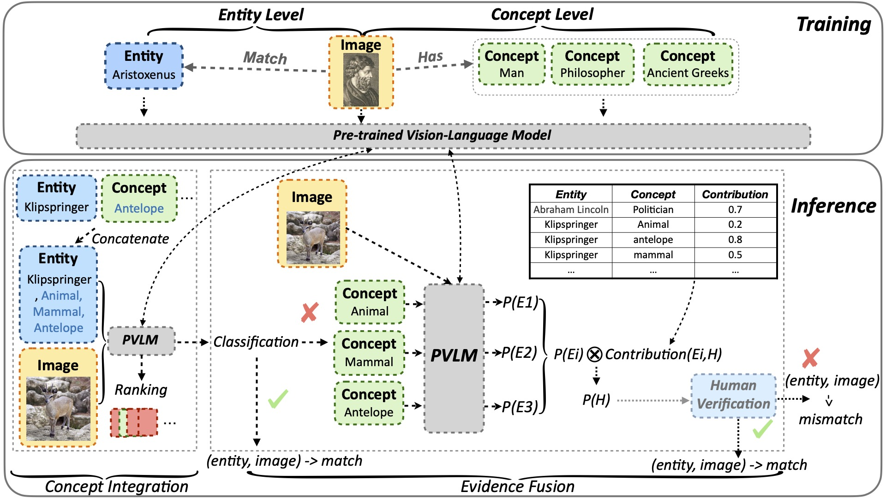

<h1 align="center"><strong>Light Up the Shadows: Enhance Long-Tailed Entity Grounding with Concept-Guided Vision-Language Models</strong></h1>


# **COG**: a two-stage framework with **CO**ncept-**G**uided vision-language models for long-tailed entity grounding.

Multi-Modal Knowledge Graphs (MMKGs) are valuable for various tasks but are hard to scale due to the presence of mismatched images, especially for long-tailed entities with scarce images online. 
Addressing this, the method of using vision-language models enhanced with **CO**ncept **G**uidance is introduced, featuring a two-stage framework named **COG**. 
**COG** consists of a **CONCEPT INTEGRATION** module to accurately identify image-text pairs for long-tailed entities and an **EVIDENCE FUSION** module for explainability. 

<p align="center">
     <br>
    <em>Overview of COG.</em>
</p>

More details are in the <a href="https://arxiv.org/pdf/2406.10902v1">Paper</a>.


## Setup Environment

Create a conda environment and install dependency:
```bash
conda create -n COG python=3.11
conda activate COG
pip install -r requirements.txt
```

## 🚀 Quick Start
### classification.sh: training and evaluation scripts for classification tasks
```
# Training

# baseline: use only entity name
python3 main.py \
    --dataset data_bundle_new.pkl \
    --ptm clip \
    --batch_size 128 \
    --gpu 0 \
    --save_path ./ckps/ \
    --con_loss \
    --do_train \
    --method onlyent \
    --threshold 0.5 \
    --task classification \
    --epoch 10 

# COG with Concept Integration, using all concepts by default
python3 main.py \
    --dataset data_bundle_new.pkl \
    --ptm clip \
    --gpu 0 \
    --save_path ./ckps/ \
    --con_loss \
    --do_train \
    --method CI \
    --con_type all \
    --threshold 0.5 \
    --task classification \
    --epoch 10


# COG with Concept Integration and Evidence Fusion, using all concepts by default
python3 main.py \
    --dataset data_bundle_new.pkl \
    --ptm clip \
    --gpu 0 \
    --save_path ./ckps/ \
    --con_loss \
    --do_train \
    --method CI_EF \
    --con_type all \
    --threshold 0.5 \
    --task classification \
    --epoch 10


# Ablation: COG with Concept Integration, using blc concepts
python3 main.py \
    --dataset data_bundle_new.pkl \
    --ptm clip \
    --gpu 0 \
    --save_path ./ckps/ \
    --con_loss \
    --do_train \
    --method CI \
    --con_type blc \
    --threshold 0.5 \
    --task classification \
    --epoch 10


# Evaluation

# baseline: use only entity name
python3 main.py \
    --dataset data_bundle_new.pkl \
    --ptm clip \
    --gpu 0 \
    --load_path "" \
    --do_eval \
    --method onlyent \
    --threshold 0.5 \
    --task classification 


# COG with Concept Integration, using all concepts by default
python3 main.py \
    --dataset data_bundle_new.pkl \
    --ptm clip \
    --gpu 0 \
    --load_path "" \
    --do_eval \
    --method CI \
    --con_type all \
    --threshold 0.5 \
    --task classification 


# COG with Concept Integration and Evidence Fusion, using all concepts by default
python3 main.py \
    --dataset data_bundle_new.pkl \
    --ptm clip \
    --gpu 1 \
    --load_path "" \
    --do_eval \
    --method CI_EF \
    --con_type all \
    --threshold 0.5 \
    --task classification \
    --save_evidence


# Ablation: COG with Concept Integration, using blc concepts
python3 main.py \
    --dataset data_bundle_new.pkl \
    --ptm clip \
    --gpu 0 \
    --load_path "" \
    --do_eval \
    --method CI \
    --con_type blc \
    --threshold 0.5 \
    --task classification 

```

### ranking.sh: training and evaluation scripts for ranking tasks
```

# Training

# baseline: use only entity name
python3 main.py \
    --dataset data_bundle_new_lp.pkl \
    --ptm clip \
    --gpu 1 \
    --save_path ./ckps/ \
    --batch_size 16 \
    --do_train \
    --method onlyent \
    --task ranking


# COG with Concept Integration, using all concepts by default
python3 main.py \
    --dataset data_bundle_new_lp.pkl \
    --ptm clip \
    --gpu 1 \
    --con_type all  \
    --con_loss \
    --save_path ./ckps/ \
    --batch_size 16 \
    --do_train \
    --method CI \
    --task ranking


# Evaluation

# baseline: use only entity name
python3 main.py \
    --dataset data_bundle_new_lp.pkl \
    --ptm clip \
    --gpu 1 \
    --load_path "" \
    --batch_size 16 \
    --do_eval \
    --method onlyent \
    --task ranking \


# COG with Concept Integration, using all concepts by default
python3 main.py \
    --dataset data_bundle_new_lp.pkl \
    --ptm clip \
    --gpu 1 \
    --load_path "" \
    --batch_size 16 \
    --do_eval \
    --con_type all \
    --method CI \
    --task ranking \
```


### Arguments
``` 
1. `--seed` refers to the random seed, with 42 as the default value.
2. `--dataset` refers to the dataset. Use data_bundle_new.pkl for classification; for ranking, use data_bundle_new_lp.pkl.
3. `--ptm` refers to the pre-trained vision-language model to be used.
4. `--ptm_lr` refers to the learning rate of the pre-trained vision-language model.
5. `--model_lr` refers to the learning rate of other modules (e.g. MLP layers).
6. `--batch_size` refers to the batch size.
7. `--epoch` refers to the number of training epochs.
8. `--weight_decay` refers to the weight decay rate.
9. `--load_path` refers to the path of the checkpoint for evaluation.
10. `--load_epoch` refers to the epoch for resuming training.
11. `--do_train` enables training mode.
12. `--do_eval` enables evaluation mode.
13. `--wandb` refers to using wandb for recording experimental results.
14. `--gpu` refers to the GPU IDs to be used.
15. `--save_path` refers to the path for saving checkpoints.
16. `--con_loss` enables using concept loss
17. `--project` refers to the wandb project name.
18. `--method` refers to the method to be used, containing 'onlyent' (using only entity name), 'CI' (Concept Integration), and 'CI_EF' (Concept Integration and Evidence Fusion).
19. `--con_type` refers to the concept type to be used, containing 'blc' (Basic-Level Concepts) and 'all' (All Concepts).
20. `--task` refers to the task, containing 'classification' and 'ranking'.
21. `--save_evidence` enables saving evidence from Evidence Fusion.
22. `--threshold` refers to the threshold for deciding whether a pair of text and image matches.
```


## Contact

If you have any problems, please contact [Yikai Zhang](mailto:ykzhang22@m.fudan.edu.cn).

## Citation

If our paper or related resources prove valuable to your research, we kindly ask for citation. 


<!-- paper citation link -->
```
@article{zhang2024light,
  title={Light Up the Shadows: Enhance Long-Tailed Entity Grounding with Concept-Guided Vision-Language Models},
  author={Zhang, Yikai and He, Qianyu and Wang, Xintao and Yuan, Siyu and Liang, Jiaqing and Xiao, Yanghua},
  journal={arXiv preprint arXiv:2406.10902},
  year={2024}
}
```

